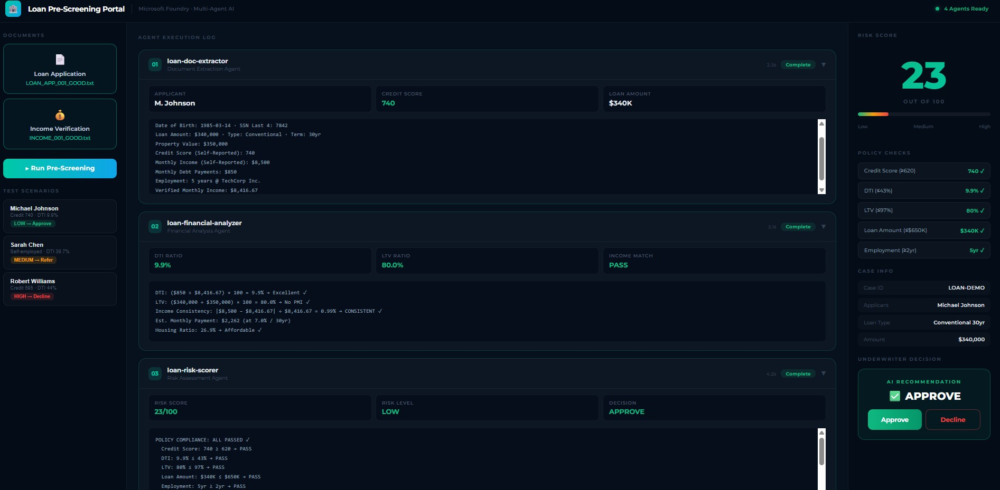

# Loan Pre-Screening Agent
### Multi-Agent AI Workflow on Microsoft Foundry

Automatically pre-screens loan applications using 4 chained AI agents. No database required — lending policy rules live in a simple JSON file.



---

## What It Does

1. Underwriter uploads **Loan Application** + **Income Verification** documents
2. Four AI agents run in sequence on **Microsoft Foundry**:
   - **loan-doc-extractor** — pulls every field from both documents
   - **loan-financial-analyzer** — calculates DTI, LTV, and affordability ratios
   - **loan-risk-scorer** — checks policy rules + scores risk 0–100
   - **loan-notifier** — sends email after the underwriter's decision
3. Underwriter clicks **Approve** or **Decline** in the web portal
4. Email notification is sent automatically

---

## Tech Stack

| Layer | Technology |
|-------|-----------|
| Agent Orchestration | Microsoft Foundry Workflow (YAML) |
| Agent Runtime | Microsoft Foundry Agent Service |
| Backend | Python / Flask |
| Real-time Updates | Server-Sent Events (SSE) |
| Policy Data | JSON file (no database) |
| Frontend | Vanilla HTML / CSS / JavaScript |
| Auth | Azure DefaultAzureCredential |

---

## Project Structure

```
Loan-Prescreening-Agent/
├── workflow_loan.yaml        ← Microsoft Foundry workflow definition
├── agents_loan.md            ← System prompts for all 4 agents
├── loan_portal.py            ← Flask backend server
├── loan_policies.json        ← Lending policy rules (edit to change limits)
├── portal/
│   └── loan.html             ← Web portal UI
├── sample_docs/
│   ├── LOAN_APP_001_GOOD.txt         Scenario 1 — Low risk → Approve
│   ├── INCOME_001_GOOD.txt
│   ├── LOAN_APP_002_HIGH_DTI.txt     Scenario 2 — Medium risk → Refer
│   ├── INCOME_002_HIGH_DTI.txt
│   ├── LOAN_APP_003_DECLINE.txt      Scenario 3 — High risk → Decline
│   └── INCOME_003_DECLINE.txt
└── env.example               ← Copy to .env and fill in your endpoint
```

---

## Live Demo

🌐 **[https://loan.prescreen.sysintinc.com](https://loan.prescreen.sysintinc.com)**

---

## Setup — Step by Step

### Step 1: Create Agents in Microsoft Foundry Portal

Go to [Microsoft Foundry Portal](https://ai.azure.com) → Your Project → Agents → New Agent.

Create these 4 agents (use exact names):

| Agent Name | MCP Tool Needed |
|-----------|----------------|
| `loan-doc-extractor` | None |
| `loan-financial-analyzer` | None |
| `loan-risk-scorer` | None |
| `loan-notifier` | `outlookworkflowemail` |

Paste each agent's system prompt from **agents_loan.md**.

### Step 2: Create the Workflow in Microsoft Foundry Portal

Go to Workflows → New Workflow → import/paste `workflow_loan.yaml`.

Name it exactly: `Loan-Prescreening-Workflow`

### Step 3: Configure Your Endpoint

```bash
cp env.example .env
# Edit .env and paste your Foundry endpoint
```

### Step 4: Install Dependencies

```bash
pip install flask azure-identity azure-ai-projects python-dotenv
```

### Step 5: Run the Portal

```bash
python loan_portal.py
```

Open **http://localhost:5001**

---

## Test Scenarios

| File | Expected Result | Why |
|------|----------------|-----|
| Scenario 1 (Michael Johnson) | LOW RISK → Approve | Credit 740, DTI 9.9%, LTV 80% |
| Scenario 2 (Sarah Chen) | MEDIUM RISK → Refer | Income mismatch 33%, DTI 39.7%, self-employed |
| Scenario 3 (Robert Williams) | HIGH RISK → Decline | Credit 595, DTI 44%, LTV 97.5%, only 8 months employed |

---

## Customizing Policy Rules

Edit `loan_policies.json` to change lending limits:

```json
"Conventional": {
    "min_credit_score": 620,   ← change this
    "max_dti_percent": 43,     ← change this
    "max_ltv_percent": 97,     ← change this
    ...
}
```

No restart needed for the workflow — the file is read fresh on each upload.

---

## Future Extension: Scanned Documents

To support scanned PDFs and images, install Azure Document Intelligence:

```bash
pip install azure-ai-documentintelligence
```

The extension hook is already documented in `loan_portal.py` (search for "FUTURE EXTENSION").

---

## How the Agent Chain Works (Microsoft Foundry Pattern)

```
User uploads docs
      ↓
  [WORKFLOW STARTS]
      ↓
First agent  → input: =System.LastMessage   (reads user's document text)
      ↓
Next agents  → input: =Local.LatestMessage  (each reads the previous agent's output)
      ↓
[APPROVAL GATE — human clicks Approve / Decline]
      ↓
loan-notifier → sends email via MCP tool
      ↓
  [WORKFLOW ENDS]
```

This chain pattern is the core of Microsoft Foundry multi-agent workflows.
Each agent builds on the previous one's output without needing any shared database.
