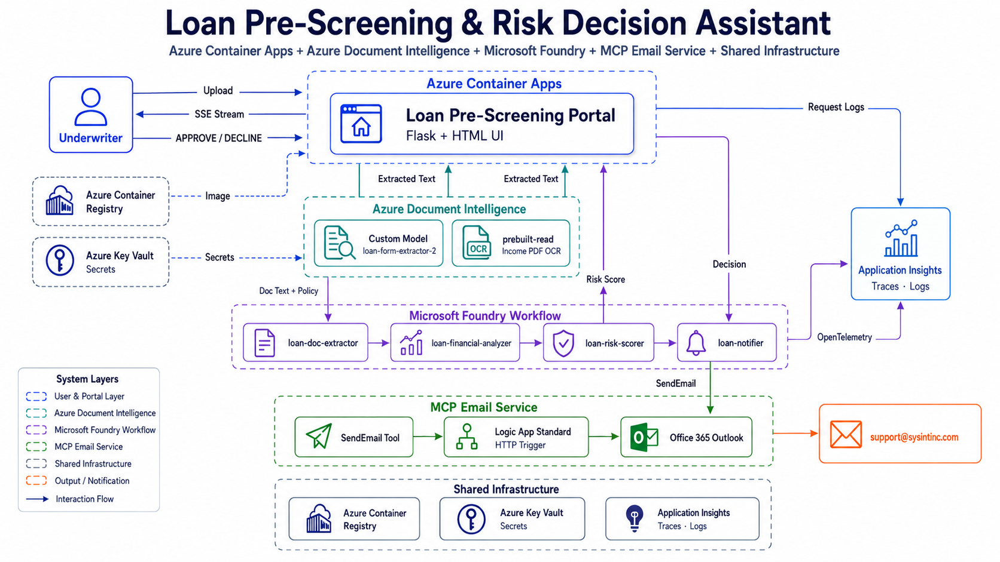
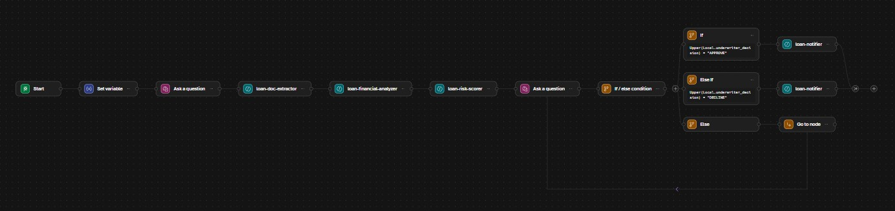

# Loan Pre-Screening Agent
### Multi-Agent AI Workflow · Microsoft Foundry · MCP Tools

> **Portfolio Project** by [Gangadhar Ananthoju](https://sysintinc.com) — demonstrating enterprise AI automation using Microsoft Foundry's multi-agent orchestration platform.

🌐 **Live Demo: [https://loan.prescreen.sysintinc.com](https://loan.prescreen.sysintinc.com)**

---

## What Is This?

Traditional loan pre-screening is a manual, time-consuming process where loan officers read documents, calculate financial ratios, check policy rules, and write decision emails — taking hours per application.

This project replaces that manual process with a **4-agent AI pipeline** built on **Microsoft Foundry**. Upload a loan application PDF and income verification document, and within minutes the system:

- Extracts all applicant data (via Azure Document Intelligence)
- Calculates DTI, LTV, and affordability ratios
- Checks against lending policy rules and scores risk 0–100
- Presents the underwriter with a clear APPROVE / REFER / DECLINE recommendation
- Sends a professional notification email after the human decision

The underwriter remains in control — the AI handles the data work, the human makes the final call. This is **Human-in-the-Loop (HITL) AI** in production.

---

## Portal Screenshot


---

## Architecture



## Foundry Workflow



**Key design decisions:**
- **No database** — lending policy rules live in `loan_policies.json`, injected into the workflow as text
- **PDF extraction** — Azure Document Intelligence custom model extracts fields at 0.99 confidence before agents run
- **Email via MCP** — the notifier agent calls a Logic App Standard exposed as an MCP server
- **Real-time UI** — Server-Sent Events (SSE) stream agent progress live to the browser

---

## The 4 AI Agents

| Agent | Job | Output |
|---|---|---|
| `loan-doc-extractor` | Reads loan application + income documents, extracts all fields | Structured applicant profile |
| `loan-financial-analyzer` | Calculates DTI ratio, LTV ratio, income consistency, monthly payment estimate | Financial ratios with threshold classification |
| `loan-risk-scorer` | Checks policy rules per loan type, scores risk 0–100 | Risk score + APPROVE / REFER / DECLINE recommendation |
| `loan-notifier` | Composes professional email, sends via MCP (Logic App → Office 365 Outlook) | Notification email to underwriting team |

Each agent automatically receives all prior agents' output through the shared conversation context — no explicit data passing needed.

---

## Tech Stack

| Layer | Technology |
|---|---|
| Agent Orchestration | Microsoft Foundry Workflow |
| Agent Runtime | Microsoft Foundry Agent Service |
| Document Extraction | Azure Document Intelligence (custom model) |
| Email Notification | Logic App Standard exposed as MCP Server |
| Backend | Python 3 / Flask + Server-Sent Events |
| Policy Rules | `loan_policies.json` (no database) |
| Frontend | Vanilla HTML / CSS / JS — Montserrat, dark glassmorphism |
| Auth | Azure Managed Identity (RBAC) — passwordless, least-privilege role assignments |
| Deployment | Azure Container Apps + Azure Container Registry |
| Secrets | Azure Key Vault |

---

## Human-in-the-Loop Pattern

```
PDF uploaded → Document Intelligence (0.99 confidence)
      ↓
Foundry Workflow starts
      ↓
Agent 1: loan-doc-extractor    → extracts applicant fields
      ↓
Agent 2: loan-financial-analyzer → calculates DTI, LTV, ratios
      ↓
Agent 3: loan-risk-scorer       → checks policy, scores 0-100
      ↓
⏸️  PAUSE — underwriter reviews and clicks APPROVE or DECLINE
      ↓
Agent 4: loan-notifier          → composes + sends email via MCP
      ↓
Workflow ends
```

The workflow pauses at the decision gate. The Flask backend detects this via SSE streaming and shows the APPROVE / DECLINE buttons. This is the HITL moment — AI presents recommendations, human makes the final decision.

---

## Test Scenarios

Three sample scenarios are included (`sample_docs/`) — downloadable directly from the portal:

| Applicant | Credit Score | DTI | LTV | Expected Result |
|---|---|---|---|---|
| Michael Johnson | 740 | 9.9% | 80% | ✅ LOW RISK → Approve |
| Sarah Chen | 665 | 39.7% | 87.5% | ⚠️ MEDIUM RISK → Refer |
| Robert Williams | 595 | 44% | 97.5% | ❌ HIGH RISK → Decline |

---

## Project Structure

```
Loan-Prescreening-Agent/
├── Dockerfile                    ← Container image for Azure Container Apps
├── loan_portal.py                ← Flask backend (SSE, DI extraction, workflow calls)
├── loan_policies.json            ← Lending policy rules per loan type
├── workflow_loan.yaml            ← Foundry workflow definition (documented)
├── agents_loan.md                ← System prompts for all 4 agents
├── requirements.txt
├── infra/
│   └── deploy.ps1                ← One-command deploy to Azure Container Apps
├── portal/
│   └── loan.html                 ← Web UI (Command Center dark theme)
├── assets/
│   ├── architecure_diagram.png   ← System architecture diagram
│   └── laon-screen.jpg           ← Portal screenshot
└── sample_docs/
    ├── LOAN_APP_001_GOOD.pdf     ← Scenario 1 — Low risk
    ├── INCOME_001_GOOD.txt
    ├── LOAN_APP_002_HIGH_DTI.pdf ← Scenario 2 — Medium risk
    ├── INCOME_002_HIGH_DTI.txt
    ├── LOAN_APP_003_DECLINE.pdf  ← Scenario 3 — High risk
    └── INCOME_003_DECLINE.txt
```

---

## Quick Start (Local)

**Prerequisites:** Azure subscription, Microsoft Foundry project with 4 agents created

```bash
# 1. Clone and configure
git clone https://github.com/GangadharAnanthoju/Loan-Prescreening-Agent
cd Loan-Prescreening-Agent
cp env.example .env
# Edit .env — add your Foundry endpoint, DI endpoint, DI key

# 2. Install dependencies
pip install -r requirements.txt

# 3. Run
python loan_portal.py
# Open http://localhost:5001
```

---

## Foundry Setup

### Step 1 — Create 4 Agents
Go to [ai.azure.com](https://ai.azure.com) → your project → **Agents → New Agent**

| Agent Name | MCP Tool |
|---|---|
| `loan-doc-extractor` | None |
| `loan-financial-analyzer` | None |
| `loan-risk-scorer` | None |
| `loan-notifier` | Logic App Standard (SendEmail MCP) |

Paste each system prompt from `agents_loan.md`.

### Step 2 — Create the Workflow
Go to **Workflows → New Workflow → Sequential**

Build the 8 steps as documented in `workflow_loan.yaml`. Name it exactly: `Loan-Prescreening-Workflow`

### Step 3 — Train Document Intelligence Model
Upload the 5 sample PDFs from `sample_docs/` to Azure Document Intelligence Studio, label 10 key fields, and train a custom extraction model. Set `DOCUMENT_INTELLIGENCE_MODEL_ID` in `.env`.

---

## Deploy to Azure Container Apps

```powershell
# First time
.\infra\deploy.ps1

# After code changes
.\infra\deploy.ps1 -Redeploy -RevisionSuffix "v2"
```

Uses shared infrastructure (ACR, ACA environment, Key Vault) — secrets are pulled from Key Vault at runtime via managed identity.

---

## Customizing Policy Rules

Edit `loan_policies.json` — no restart or redeployment needed:

```json
"Conventional": {
    "min_credit_score": 620,
    "max_dti_percent": 43,
    "max_ltv_percent": 97,
    "max_loan_amount": 650000,
    "min_employment_years": 2
}
```

---

## Related Projects

Part of a portfolio series demonstrating Microsoft Foundry multi-agent workflows:
- **Invoice Processing Agent** — `../Microsoft-Foundry-Multi-Agent-Workflow`
- **Loan Pre-Screening Agent** — this repo
